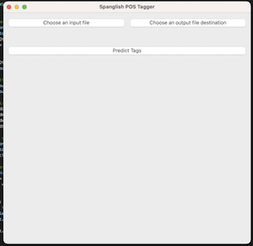

# Spanglish POS Tagger

This repository includes several tools for the automation of the annotation of multilinugual corpora.

## The Problem

Monologues were recorded from bilingual research participants at the University of Illinois's [Second Language Acquisition and Bilingualism Lab](https://publish.illinois.edu/uiuc-slab/) and then manually transcribed. We are interested in extracting insights from these participants' speech production so we would like for our data to be annotated for various linguistic features (syntactic tags & morphological tags) so that we can extract statistics from this largely unstructured text data.

## Solution: A (Deep-Neural) Part of Speech Tagger Trained Specifically on Bilinguals Who Code Switch

### Model Description

This model uses Conditional Random Fields with contextualized text embeddings from Google's 110 million parameter [Multilingual Bidirectional Encoder Representations from Transformers (mBERT)](https://arxiv.org/abs/1810.04805) language model as feature inputs for part-of-speech tagging. The Part-of-Speech tagging model was fine tuned on the [Bilinguals in the Midwest Corpus](https://aclanthology.org/2022.lrec-1.590/) and the [Bangor Miami corpus](http://bangortalk.org.uk/speakers.php?c=miami) which contains code switched dialog from native spanish speakers living in the midwestern and southern United States respectively.

### Model Intuition

Transformers, introduced in [Viswani et al Attention is All You Need (2017)](https://arxiv.org/abs/1706.03762) are the current state of the art on most sequence to sequence and natural processing tasks as the positional encoding and scaled dot product attention mechanism in Transformers allows for the model to learn contextual relationships between words in a whole sentence just like recurrent neural networks, but Transformers can process each element in a sequence in parallel rather than serially leading to great computational cost benefits. Those computational cost savings have allowed Google to train on an absolutely huge dataset with many many parameters. The appeal of BERT over other Transformer based architectures such as [GPT (Generative Pretrained Transformer)](https://cdn.openai.com/research-covers/language-unsupervised/language_understanding_paper.pdf) is that BERT is a purely Transformer Encoder based model (opposed to Decoder or Encoder-Decoder) meaning that it uses both forward and backward context, in this case as the masked language modeling objective, to generate contextualized dense vector embeddings. The multilingual variant is particularly appealing for our task as both Spanish and English texts were included in the training set so it comes with knowledge of both languages "baked in". I hypothesize that by fine tuning on a dataset with explicit examples of code switching with English and Spanish then the model will be able to learn a relationship between English and Spanish words similar vain that relationships can be learned as demonstrated by Mikolov et al 2013 but within the specific context of part-of-speech tagging.

### Usage

#### Inference

I've uploaded pre-trained PyTorch weights to [HuggingFace Model Hub](https://huggingface.co/benevanoff/spanglish-upos) so that the model can be used for inference without training from scratch.

[example.py](./example.py) contains an example for how to download and use these pre-trained weights.

#### Training

Before training, see the [installation section](./README.md#installation)

The training script takes 2 binary parameters.

* USE_CRF - If `1`, conditional random fields will be used in inference on the final classification layer. If `0`, a softmax regression will be used in the classification layer.
* use_whole_bm_herring - If `1` all the data available from the Bangor Miami Corpus will be used for training (excluding dev/tetset). If `0`, only utterances featuring code switching will be used.

To train with the recommended parameters, use `python3 MBERT_pos_tagger.py 1 0`

### A Multilingual Multilabel Morphological Tag Classifier For Code-Switched Text

After such success with the multilingual part of speech tagger, I tweaked the best performing model to train with the binary cross entropy loss function and re-processed the Bangor Miami corpus to use multihot encoded vectors for the labels so that it could learn to assign several labels at once. This currently exists as a proof of concept in the MBERT-Multilabel folder and works well for assigning gender (M/F) and tense (Present/Past/Future) tags.

## Installation

### Dependencies

* Python3
* PyTorch
* Flair
* NLTK
* PySide6

To install these dependencies, run `python3 -m pip install -r requirements.txt`

Additionally, the `MUSE-BiLSTM-CRF` model which requires the projected Spanish and English word embedding vectors to be downloaded from [Facebook's FastText](https://github.com/facebookresearch/fastText)

### The GUI-Tagger

To provide a more user friendly and accessible way of using these models I have built a simple Graphical User Interface utilizing the [Qt graphics library](https://www.qt.io/qt-for-python).

Simply run `python3 tools/gui_tagger.py` to start the app.

#### Usage

Provide a .cha file as input with the button labeled "Choose an input file". Then click the "Choose an output file" to provide the location to store the output file. Once you have clicked "Predict Tags" a new .cha file will be written to your specified save location. The newly output .cha file will contain an additional `%pos` layer after each utterance. A comment with a timestamp stating that the file was generated by this program.

### Corpus Tagger

To tag a corpus of .cha files in bulk, run `python tools/corpus_tagger.py [corpus_folder_path]`