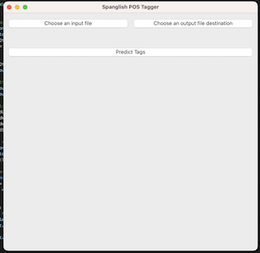

# Spanglish POS Tagger

This repository includes several tools for the automation of the annotation of multilinugual corpora.

## The Problem

Monologues were recorded from bilingual research participants at the University of Illinois's [Second Language Acquisition and Bilingualism Lab](https://publish.illinois.edu/uiuc-slab/) and then manually transcribed. We are interested in extracting insights from these participants' speech production so we would like for our data to be annotated for various linguistic features (syntactic tags & morphological tags) so that we can extract statistics from this largely unstructured text data.

Automated grammatical tagging is not particularly new, systems to solve this problem have been devised since the late 80s/90s (see [Tagging English Text with a Probabilistic
Model, Merialdo 1994](https://aclanthology.org/J94-2001.pdf)) and modern state of the art approaches acheive >95% accuracy, but such publicly available tools are trained on monolingual datasets and struggle immensly in contexts where code switching is common.

Here are examples of different existing part-of-speech taggers trying to tag code switched English-Spanish text: [TODO]

## The Solution

### A Multilingual Part of Speech Classifier For Code-Switched Text

I trained several different multi-class classifiers on a combination of monolingual English and monolingual Spanish corpora from the [Universal Dependencies dataset](https://universaldependencies.org/) as well as the [Bangor Miami corpus](http://bangortalk.org.uk/speakers.php?c=miami) which contains code switched dialog from native spanish speakers living in the southern United States.

The most successful model was a classifier which utilized contextualized text embeddings from a version of [Multilingual-BERT](https://github.com/google-research/bert/blob/master/multilingual.md) that was fine tuned on our dataset. The multilingual nature of MBERT's pretraining set provides a very good foundational representation of the context in which both Spanish and English words are used and fine tuning with a domain specific dataset and an additional attention layer allows the model to better learn how to handle code switching.

### A Multilingual Multilabel Morphological Tag Classifier For Code-Switched Text

After such success with the multilingual part of speech tagger, I tweaked the best performing model to train with the binary cross entropy loss function and re-processed the Bangor Miami corpus to use multihot encoded vectors for the labels so that it could learn to assign several labels at once. This currently exists as a proof of concept in the MBERT-Multilabel folder and works well for assigning gender (M/F) and count (S/PL) tags.

## How to use

### Training the model

The majority of the models found in the `models` folder can be trained simply by running the associated python program.
The only exception is the `MUSE-BiLSTM-CRF` model which requires the projected Spanish and English word embedding vectors to be downloaded from [Facebook's FastText](https://github.com/facebookresearch/fastText)

### The GUI-Tagger

To provide a more user friendly and accessible way of using these models I have built a simple Graphical User Interface utilizing the [Qt graphics library](https://www.qt.io/qt-for-python).

Once you have trained your model, make sure to name it `gui-model.pt` and place it in the `models` folder for a complete relative path of `models/gui-model.pt` so that the GUI program will be able to find it. Then you can start the GUI program by running `python3 gui_tagger.py`.

#### Usage

Provide a .cha file as input with the button labeled "Choose an input file". Then click the "Choose an output file" to provide the location to store the output file. Once you have clicked "Predict Tags" a new .cha file will be written to your specified save location. The newly output .cha file will contain an additional `%pos` layer after each utterance. A comment with a timestamp stating that the file was generated by this program.

